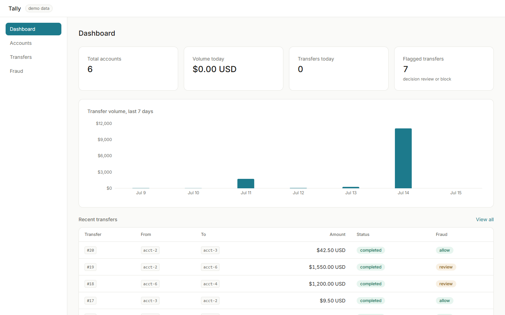
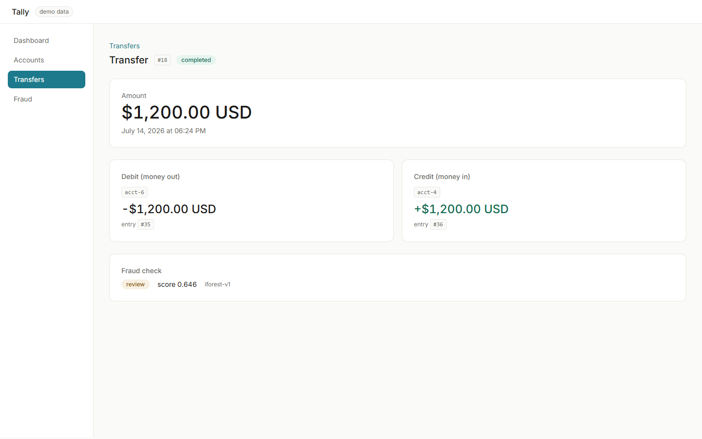
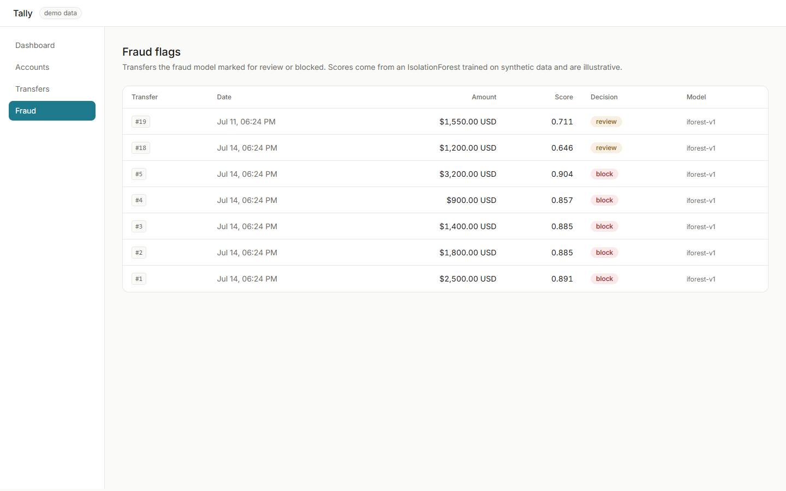
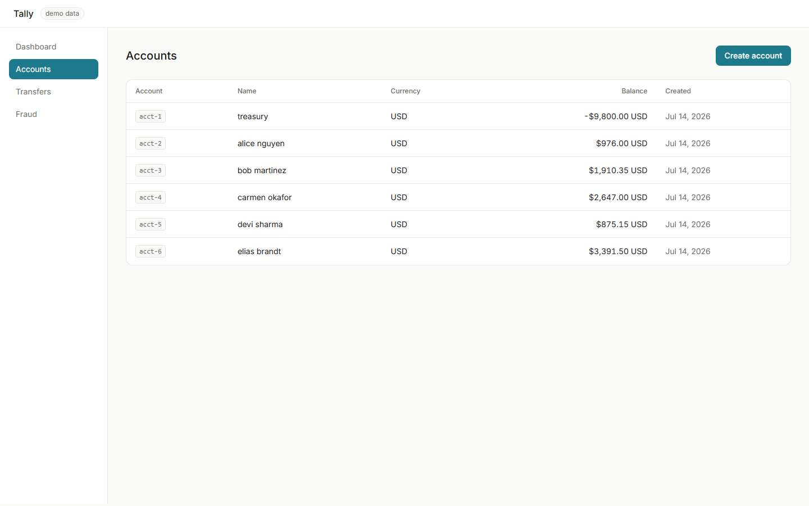
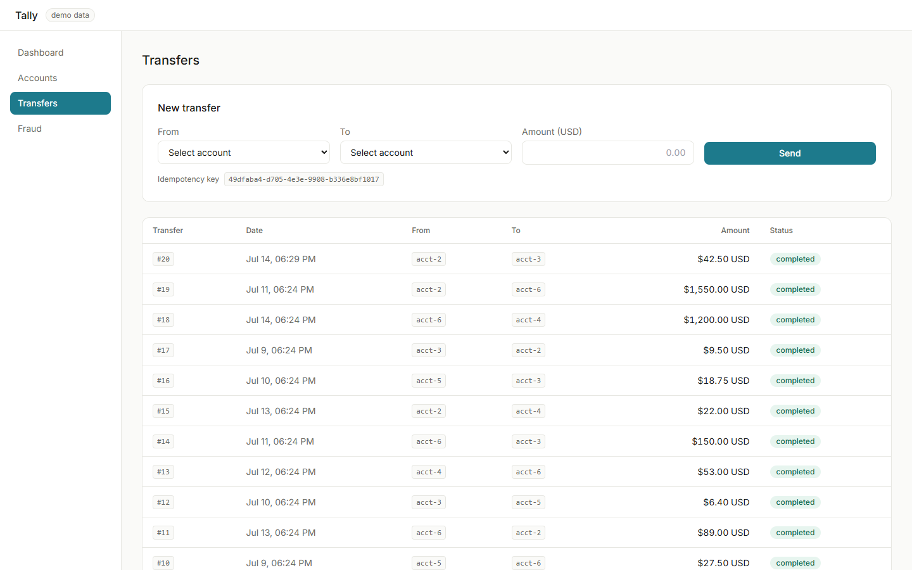

# Tally

A payments ledger backend with correct double-entry money movement, idempotent
transfers, a fraud-scoring service, and a web dashboard. This repository is a
portfolio project; correctness of the money math is the top priority.

Money is never a float. All amounts are integer minor units (cents), stored as
`BIGINT` in Postgres and `int64` in Go.



## Status

**All three build phases are complete**: the ledger core, events + fraud
scoring, and the dashboard.

What works today:

- Create accounts and transfers over a REST API.
- Every transfer is double-entry (a debit on the source, a credit on the
  destination) written in one database transaction.
- Transfers are idempotent: the same `Idempotency-Key` never moves money twice.
- Accounts are locked in a consistent order, so concurrent transfers cannot
  corrupt balances.
- After each transfer commits, the ledger publishes a `transfers.completed`
  event to Kafka (Redpanda).
- A Python fraud service consumes those events, scores each transfer, writes a
  `fraud_scores` row, and publishes `fraud.scored`. Consuming the same event
  twice cannot create a second score (unique index + upsert).
- Transfer detail includes the fraud score; `/v1/fraud/flags` lists transfers
  whose decision is `review` or `block`.
- A Next.js dashboard at `http://localhost:3000`: stat cards, a 7 day volume
  chart, account and transfer browsing with running balances, a transfer form
  that generates idempotency keys client-side, and a fraud flags page. Transfer
  detail shows the two ledger entries side by side so the double-entry idea is
  visually obvious.
- Test suites cover the money invariants, idempotency, concurrency, the fraud
  feature builder, decision mapping, and duplicate-event dedupe.

**About the fraud model, honestly:** the IsolationForest is trained on
synthetic data with a fixed seed (`services/fraud/train.py`) and blended with
simple explainable rules. It is illustrative, not production fraud detection.

## Architecture

```
Browser
     |
     v  http://localhost:3000
  Dashboard (Next.js, Tailwind)
     |
     v  REST/JSON  (:8080)
  Gateway (Go, chi)
     |
     v  gRPC       (:9090)
  Ledger service (Go) ----> Postgres
     |                         ^
     | publishes after commit  | writes fraud_scores
     v                         |
  Redpanda (Kafka API) --> Fraud service (Python, scikit-learn)
```

The gateway is a thin translator: it validates request shape, forwards to the
ledger service over gRPC, and maps gRPC status codes to HTTP codes. All the
money rules live in the ledger service (`services/ledger/internal/domain` and
`.../store`). Events are published only after the database transaction commits,
so a transfer is never announced unless it actually happened.

## Run it

Docker is the only prerequisite (no local Go, Node, protoc, or Postgres needed).

```bash
make up      # build and start everything
make seed    # recommended: insert demo accounts and transfers
```

Then open `http://localhost:3000` for the dashboard. The API is at
`http://localhost:8080`. Stop with `make down`.

## Screenshots

| Transfer detail (double entry) | Fraud flags |
| --- | --- |
|  |  |

| Accounts | Transfers |
| --- | --- |
|  |  |

### Try it with curl

```bash
# create two accounts (treasury may go negative so it can fund others)
curl -s -X POST localhost:8080/v1/accounts \
  -H 'content-type: application/json' \
  -d '{"name":"treasury","currency":"USD","allow_negative":true}'
curl -s -X POST localhost:8080/v1/accounts \
  -H 'content-type: application/json' \
  -d '{"name":"alice","currency":"USD"}'

# move $15.00 (1500 minor units), account 1 -> account 2
curl -s -X POST localhost:8080/v1/transfers \
  -H 'Idempotency-Key: my-key-1' \
  -H 'content-type: application/json' \
  -d '{"source_account_id":1,"dest_account_id":2,"amount_minor":1500,"currency":"USD"}'

# send the SAME request again with the SAME key: money does not move twice,
# the same transfer is returned
curl -s -X POST localhost:8080/v1/transfers \
  -H 'Idempotency-Key: my-key-1' \
  -H 'content-type: application/json' \
  -d '{"source_account_id":1,"dest_account_id":2,"amount_minor":1500,"currency":"USD"}'

# see the transfer and its two ledger entries
curl -s localhost:8080/v1/transfers/1
```

## API (phase 1)

Base path `/v1`. All money fields are integer minor units.

| Method | Path | Notes |
| ------ | ---- | ----- |
| POST | `/v1/accounts` | create an account |
| GET | `/v1/accounts` | list accounts |
| GET | `/v1/accounts/{id}` | account detail with balance |
| GET | `/v1/accounts/{id}/entries` | ledger entries for an account |
| POST | `/v1/transfers` | create a transfer; requires header `Idempotency-Key` |
| GET | `/v1/transfers` | list transfers (`?limit=&before_id=`) |
| GET | `/v1/transfers/{id}` | transfer detail with its two ledger entries and fraud score if scored |
| GET | `/v1/fraud/flags` | transfers with fraud decision `review` or `block` |
| GET | `/healthz`, `/readyz` | liveness / readiness |

Status codes: `201` create, `200` read, `400` bad input, `404` not found,
`409` idempotency conflict (same key, different request), `422` business rule
rejection (insufficient funds, currency mismatch).

## Tests

```bash
make test
```

This spins up a throwaway Postgres and runs the Go and Python suites, including:

- per-transfer invariant: debits equal credits equal the transfer amount;
- per-account invariant: cached balance equals the balance recomputed from
  ledger entries;
- system-wide invariant: the signed sum of every ledger entry is exactly zero
  (money is conserved);
- idempotency: a duplicate key moves money once; a reused key with a different
  request conflicts;
- concurrency: 50 simultaneous transfers never lose an update, and 20
  goroutines racing with the same key produce exactly one transfer;
- fraud: feature builder validation, rule scoring, score-to-decision thresholds,
  and consuming the same event twice writes exactly one fraud_scores row.

The concurrency tests are also run under the Go race detector.

## Layout

```
proto/ledger.proto                     gRPC contract
services/ledger/
  cmd/ledger/                          service entrypoint
  internal/domain/                     money rules (pure Go, no DB)
  internal/store/                      pgx queries + the transfer transaction
  internal/grpcserver/                 gRPC server, error mapping
  internal/events/                     kafka publisher (after commit only)
  migrations/                          .sql schema migrations
services/gateway/                      REST -> gRPC
services/fraud/
  consumer.py                          kafka consumer, idempotent score writes
  model.py                             features, rules, IsolationForest scoring
  train.py                             trains the model on synthetic data
web/                                   Next.js dashboard (TypeScript, Tailwind)
k8s/                                   Kubernetes manifests (ledger service)
infra/                                 Terraform example (RDS Postgres)
scripts/seed.sh                        demo data
docker-compose.yml, Makefile, Dockerfile
.github/workflows/ci.yml               lint + tests for Go, Python, and web
```

## Regenerating gRPC code

The generated `proto/*.pb.go` files are committed. Regenerate them after editing
`proto/ledger.proto`:

```bash
make proto
```
